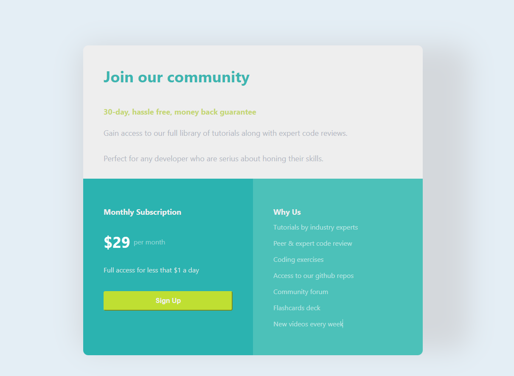

# Single Price Grid Component

This is a **Single Price Grid Component** built using **React.js**. The component is a solution to the **Frontend Mentor** challenge that involves building a responsive single price grid. It displays different pricing plans for services or products, with a clean and modern layout.

## Features

### User Features:
1. **Home Page:**
   - Three pricing plans with details such as:
     - Plan name (e.g., Basic, Pro, Business).
     - Price per month.
     - Features included in each plan.
     - "Sign Up" button for each plan.
   - Responsive layout that adapts to different screen sizes.
   - Hover effects for interactive pricing cards.

2. **Pricing Plans:**
   - Each pricing card contains:
     - Plan title.
     - Monthly cost.
     - Key features of the plan (e.g., storage size, number of users, data access).
     - CTA (Call-to-action) button to sign up.

3. **Responsive Design:**
   - Fully responsive across various devices like mobile, tablet, and desktop.
   - Organized layout that adjusts based on screen size for optimal user experience.

4. **Simple and Clean Design:**
   - Minimalistic UI with focus on clear typography and easy-to-understand pricing details.
   - Suitable for displaying service tiers or subscription models.

### Navigation Bar:
- Simple navigation without complex menus.
- Links to additional sections such as Sign Up and other calls to action (depending on future expansion).

### Admin Features:
1. **Dashboard (Future Expansion):**
   - The app can be easily extended to support an admin panel where pricing details, plans, and content can be managed dynamically.
   
## Technology Stack
- **Frontend:** React.js
- **Styling:** CSS Modules
- **State Management:** React's useState and useEffect hooks for dynamic functionality.
  
## Images



## Installation

To run this project locally, follow these steps:

1. Clone the repository:
   ```bash
   git clone https://github.com/Portia-Nelly-Mashaba/Single-price-grid-component
   ```

2. Navigate to the project directory:
   ```bash
   cd single-price-grid-component
   ```

3. Install the dependencies:
   ```bash
   npm install
   ```

4. Start the development server:
   ```bash
   npm start
   ```

   The app should now be running at `http://localhost:3000` in your browser.

## Usage

You can navigate through the pricing plans and interact with the "Sign Up" buttons for each plan. The app is designed to be extended with additional functionality, such as linking each "Sign Up" button to a registration page.


## Acknowledgements:
- **Frontend Mentor**: The challenge was provided by [Frontend Mentor](https://www.frontendmentor.io/challenges), a platform that helps developers build their front-end skills by working on real-world projects.
  
---

If you find this project interesting, consider using [Hix AI](https://hix.ai/chat), an excellent ChatGPT alternative, for enhanced productivity!